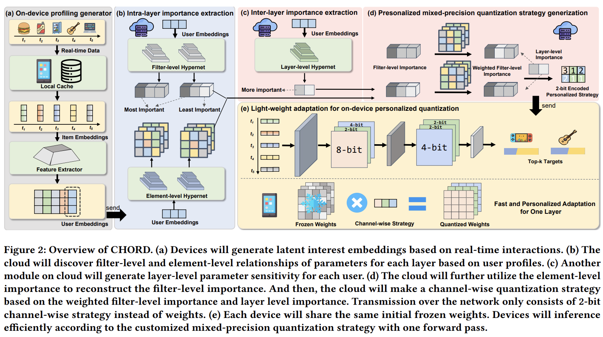








My name is **Tianqi Liu (zh: 刘天琦)**. I am currently a first-year MS student in Zhejiang University, under the supervision of Prof.[Shengyu Zhang](https://person.zju.edu.cn/shengyuzhang).

My research interest primarily focuses on the **recommender systems**, especially **model customization and lightweight deployment**. I also aim to tackle the real-time **large-small model collaboration** challenges, caused by the resource and interest heterogeneity between mobile devices and cloud servers. Recently, I grow interest in the **recommendations with large language models** and how to intelligently combine the traditional collaborative info with them, balancing the inference accuracy and efficiency.

# 🔥 News
- *2025.07*: &nbsp;🎉🎉 One first-author paper has been accepted to MM 2025. 

# 📝 Publications

MM 2025 (To appear)

[CHORD: Customizing Hybrid-precision On-device Model for Sequential Recommendation with Device-cloud Collaboration](https://www.arxiv.org/pdf/2510.03038)

**Tianqi Liu**, Kairui Fu, Shengyu Zhang, Wenyan Fan, Zhaocheng Du, Jieming Zhu, Fan Wu, Fei Wu

- A framework for device-cloud collaborative personalized mixed-precision quantization that achieves model customization and compression with one forward pass.
- Frozen weights + Channel-wise quantization strategy  = Fast AND Personalized model adaptation.

# 🎖 Honors and Awards
- *2025.6* Outstanding Graduates of Tongji University
- *2024.12* Outstanding student of Tongji University (Top 5%)
- *2024.12* Scholarship of Tongji University
- *2023.12* Scholarship of Tongji University
- *2022.12* Outstanding student of Tongji University (Top 5%)
- *2022.12* Scholarship of Tongji University

# 📖 Educations
- *2025.09 - present*, Master, Artificial Intelligence, Zhejiang University.
- *2021.09 - 2025.06*, Undergraduate, Software Engineering, Tongji University.

# 💻 Internships
- *2025.03 - 2025.05*, [Huawei Noah’s Ark Lab](http://dev3.noahlab.com.hk/index.html), China.
