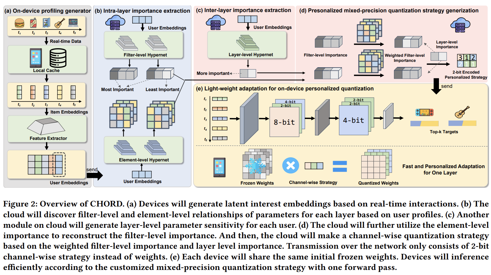
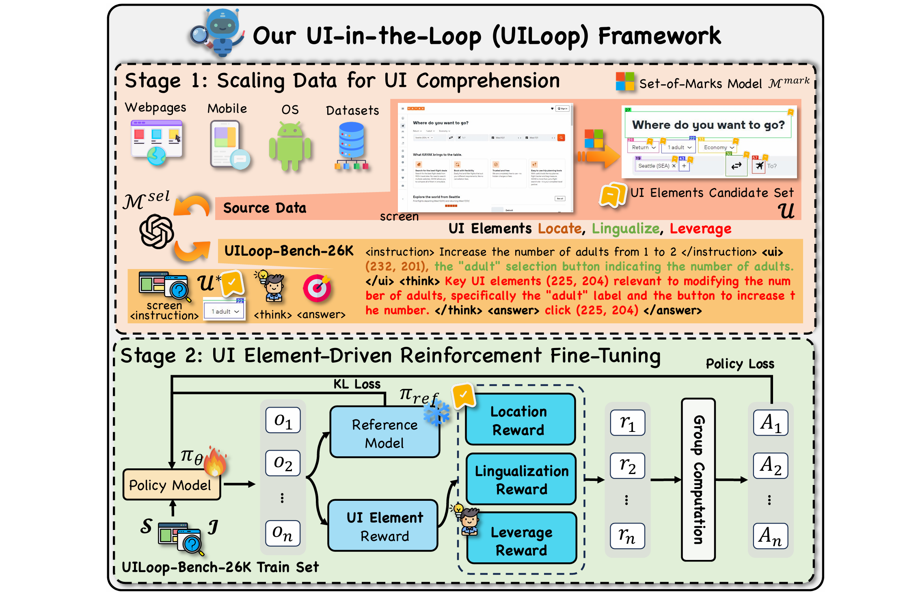








My name is **Tianqi Liu (zh: 刘天琦)**. I am currently a first-year MS student in Zhejiang University, under the supervision of Prof.[Shengyu Zhang](https://person.zju.edu.cn/shengyuzhang).

My research interests primarily focus on **recommender systems** and **LLM agents**, particularly in **model customization, lightweight deployment, and reinforcement-learning-based refinement**. Recently, I have developed a growing interest in **personalized, user-centric LLM agents**, seeking to tackle the challenges of proactive interaction in human-agent interaction. 

# 🔥 News
- *2026.04*: &nbsp;🎉🎉 One paper has been accepted to ACL 2026.
- *2025.10*: &nbsp;🥳🥳 I went to Dublin, Ireland, to deliver an oral presentation of our paper CHORD in ACM MM 2025.
- *2025.07*: &nbsp;🎉🎉 One first-author paper has been accepted to ACM MM 2025.

  
# 📝 Publications

MM 2025

  
[CHORD: Customizing Hybrid-precision On-device Model for Sequential Recommendation with Device-cloud Collaboration](https://www.arxiv.org/pdf/2604.06995)

**Tianqi Liu**, Kairui Fu, Shengyu Zhang, Wenyan Fan, Zhaocheng Du, Jieming Zhu, Fan Wu, Fei Wu

- A framework for device-cloud collaborative personalized mixed-precision quantization that achieves model customization and compression with one forward pass.
- Frozen weights + Channel-wise quantization strategy  = Fast AND Personalized model adaptation.

ACL 2026

[What’s Missing in Screen-to-Action? Towards a UI-in-the-Loop Paradigm for Multimodal GUI Reasoning](https://www.arxiv.org/pdf/2510.03038)

Songze Li, Xiaoke Guo, **Tianqi Liu**, Biao Yi, Zhaoyan Gong, Zhiqiang Liu, Huajun Chen, Wen Zhang

- A GUI reasoning framework utilizing a 'Screen-UI Elements-Action' loop to achieve interpretable decision-making and precise interface parsing.
- UI-Driven RL (localization + semantics + utilization) + 26K UI-Comprehension Benchmark = Transparent multi-step GUI automation.
- [Project](https://github.com/zjukg/UILoop)

# 🎖 Honors and Awards
- *2025.06* Outstanding Graduates of Tongji University
- *2024.12* Outstanding student of Tongji University (Top 5%)
- *2024.12* Scholarship of Tongji University
- *2023.12* Scholarship of Tongji University
- *2022.12* Outstanding student of Tongji University (Top 5%)
- *2022.12* Scholarship of Tongji University

# 📖 Educations
- *2025.09 - present*, Master, Artificial Intelligence, Zhejiang University.
- *2021.09 - 2025.06*, Undergraduate, Software Engineering, Tongji University.

# 💻 Internships
- *2025.03 - 2025.05*, [Huawei Noah’s Ark Lab](http://dev3.noahlab.com.hk/index.html), China.
